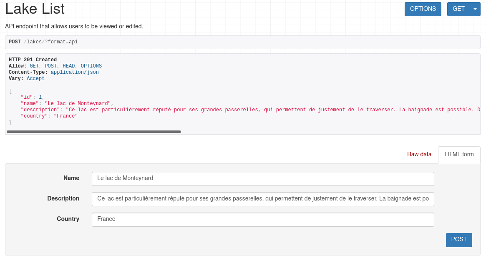
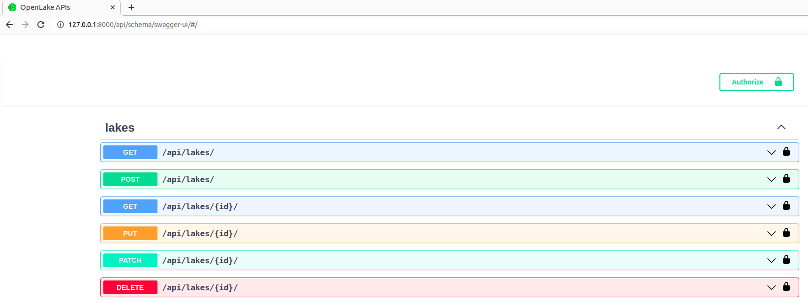

# Development guide

This backend project is build around Django REST framework. 

We introduce some concepts explanations and good practices to develop in team.     

[[_TOC_]]

## Knowledge requirements

To understand how the backend is working, you need some skills with django. The following tutorials can be a good start: 

- https://docs.djangoproject.com/en/3.2/intro/tutorial01/
- https://www.django-rest-framework.org/tutorial/quickstart/
- https://www.bezkoder.com/django-angular-12-crud-rest-framework/


## Framework scheme

TO-DO: Explain how Django REST framework works and how parts communicate.

Explain MVC, MVT and our approach

https://data-flair.training/blogs/django-rest-framework/

## Model

### Overview

> A model is the single, definitive source of information about your data. It contains the essential fields and behaviors of the data you’re storing. Generally, each model maps to a single database table.
>
> The basics:
>
> - Each model is a Python class that subclasses [`django.db.models.Model`](https://docs.djangoproject.com/en/3.2/ref/models/instances/#django.db.models.Model).
> - Each attribute of the model represents a database field.
> - With all of this, Django gives you an automatically-generated database-access API; see [Making queries](https://docs.djangoproject.com/en/3.2/topics/db/queries/).

Source: [Official Django documentation](https://docs.djangoproject.com/en/3.2/topics/db/models/)

### Example

#### Define a lake

```python
class Lake(models.Model):
    """Class to represent a lake. It inherits from django.db.models.Model. 

    Resources:
    `Django fields documentation <https://docs.djangoproject.com/en/3.2/ref/models/fields/>`_
    """

    name = models.CharField(max_length=100)
    """A string field to store lake name.

        * max_length: 100 characters
    """

    description = models.CharField(max_length=2000)
    """A large text field to store lake's description.

        * max_length: 2000 characters
    """
    
    country = models.CharField(max_length=100)
    """A string field to store lake's country.

        * max_length: 100 characters
    
    According to `worldatlas <https://www.worldatlas.com/articles/what-is-the-longest-country-name-in-the-world.html>`_ the longest country name is "The United Kingdom of Great Britain and Northern Ireland" (English: 56 characters, French: 42 characters).
    """
```

#### Get all data

#### Get by ID


## Django migrations

### Overview

> Migrations are Django’s way of propagating changes you make to your models (adding a field, deleting a model, etc.) into your > database schema.
>
> There are several commands which you will use to interact with migrations and Django’s handling of database schema:
>
> * migrate, which is responsible for applying and unapplying migrations.
> * makemigrations, which is responsible for creating new migrations based on the changes you have made to your models.
> * sqlmigrate, which displays the SQL statements for a migration.
> * showmigrations, which lists a project’s migrations and their status.
>
> You should think of migrations as a version control system for your database schema. makemigrations is responsible for packaging up your model changes into individual migration files - analogous to commits - and migrate is responsible for applying those to your database. 

Source: [Official Django documentation](https://docs.djangoproject.com/en/3.2/topics/migrations/)


### Example

Generate migrations based on models:

```bash
python3.8 manage.py makemigrations
```


List migrations :

```bash
python3.8 manage.py showmigrations
```


Show migrations SQL requests :

```bash
python3.8 manage.py sqlmigrate openlake_core 0001_initial
```

Replace app_label and migration_name if needed.


Apply migrations:

```bash
python3.8 manage.py migrate
```

Optionally add app_label as argument. 


## Serializers

### Overview

> Serializers allow complex data such as querysets and model instances  to be converted to native Python datatypes that can then be easily  rendered into `JSON`, `XML` or other content  types.  Serializers also provide deserialization, allowing parsed data  to be converted back into complex types, after first validating the  incoming data.
>
> The serializers in REST framework work very similarly to Django's `Form` and `ModelForm` classes. We provide a `Serializer` class which gives you a powerful, generic way to control the output of your responses, as well as a `ModelSerializer` class which provides a useful shortcut for creating serializers that deal with model instances and querysets.

Source: [Django REST framework: serializers](https://www.django-rest-framework.org/api-guide/serializers/)


Serialization aims us to convert our data (models in our case) in python datatypes (JSON in our case) understandable by javascript and front-end frameworks.  

Deserialization validate incoming data and convert back data into models.	


### Example

#### Declare a ModelSerializer:

```python
class LakeSerializer(serializers.ModelSerializer):
    """
    LakeSerializer class provides a shortcut that lets you automatically 
    create a Serializer class with fields that correspond to the Model 'Lake' 
    fields. It inherits from rest_framework.serializers.ModelSerializer. 

    Resources:
    `Django REST framework ModelSerializer documentation 
    <https://www.django-rest-framework.org/api-guide/serializers/#modelserializer>`_
    """
    class Meta:
        model = Lake
        fields = ('id',
                  'name',
                  'description',
                  'country')
```

Just with few lines of code, it generate our CRUD (Create, Read, Update, Delete) API:


#### Declare a serializer 


## API views

### Overview


#### ViewSet

> Django REST framework allows you to combine the logic for a set of related views in a single class, called a `ViewSet`.  In other frameworks you may also find conceptually similar implementations named something like 'Resources' or 'Controllers'.
>
> A `ViewSet` class is simply **a type of class-based View, that does not provide any method handlers** such as `.get()` or `.post()`, and instead provides actions such as `.list()` and `.create()`.
>
> The method handlers for a `ViewSet` are only bound to the corresponding actions at the point of finalizing the view, using the `.as_view()` method.
>
> Typically, rather than explicitly registering the views in a viewset  in the urlconf, you'll register the viewset with a router class, that  automatically determines the urlconf for you.

Source: [Django REST framework: ViewSet](https://www.django-rest-framework.org/api-guide/viewsets/)


#### APIView

> REST framework provides an `APIView` class, which subclasses Django's `View` class.
>
> `APIView` classes are different from regular `View` classes in the following ways:
>
> - Requests passed to the handler methods will be REST framework's `Request` instances, not Django's `HttpRequest` instances.
> - Handler methods may return REST framework's `Response`, instead of Django's `HttpResponse`.  The view will manage content negotiation and setting the correct renderer on the response.
> - Any `APIException` exceptions will be caught and mediated into appropriate responses.
> - Incoming requests will be authenticated and appropriate permission  and/or throttle checks will be run before dispatching the request to the handler method.
>
> Using the `APIView` class is pretty much the same as using a regular `View` class, as usual, the incoming request is dispatched to an appropriate handler method such as `.get()` or `.post()`.  Additionally, a number of attributes may be set on the class that control various aspects of the API policy.

Source: [Django REST framework: APIViews](https://www.django-rest-framework.org/api-guide/views/)


### Example

## URL dispatcher and router

### Overview

https://docs.djangoproject.com/en/3.2/topics/http/urls/


### Example


### 


## Good practices check list


- [ ] "Code is read much more often than it is written" Please respects [PEP8](https://www.python.org/dev/peps/pep-0008/). Pay particular attention to:
  - [ ] [Indentation](https://www.python.org/dev/peps/pep-0008/#indentation)
  - [ ] [Maximum Line Length](https://www.python.org/dev/peps/pep-0008/#maximum-line-length)
  - [ ] [Blank Lines](https://www.python.org/dev/peps/pep-0008/#blank-lines)
  - [ ] [Imports](https://www.python.org/dev/peps/pep-0008/#imports)
- [ ] Naming convention:
  - [ ] Modules should have short, all-lowercase names.  Underscores can be used in the module name if it improves readability.  (e.g. openlake_core)
  - [ ] Never use single character variable names.
  - [ ] Class names should use the CapWords convention and respect corresponding suffix:
    - [ ] ViewSet example: LakeViewSet
    - [ ] Model example: Lake
    - [ ] Serializer example: LakeSerializer
  - [ ] Function names should be lowercase, with words separated by underscores as necessary to improve readability.
  - [ ] Variable names follow the same convention as function names.
  - [ ] Constants are usually defined on a module level and written in all capital letters with underscores separating words.  
- [ ] Models
  - [ ] Field names should be all lowercase, using underscores instead of camelCase
  - [ ] Add docstring for classes, functions and fields
- [ ] Views
  - [ ] Add docstring for classes and functions
- [ ] Serializers
  - [ ] Add docstring for classes and functions
- [ ] Documentation
  - [ ] In-line # comment are accepted but docstrings are encouraged (Sphinx documentation)
  - [ ] Always wright comments in english
  - [ ] Compil and check sphinx documentation 
- [ ] Always clearly comment imports. Do not let useless imports lines in code !
- [ ] The `class Meta` should appear *after* the fields are defined, with a single blank line separating the fields and the class definition.


Further informations: [Django coding style](https://docs.djangoproject.com/en/dev/internals/contributing/writing-code/coding-style/), [PEP8](https://www.python.org/dev/peps/pep-0008/).

## Documentation

### Code

Sphinx is a tool to create python documentation. Output formats are HTML, LaTeX, PDF...

Sphinx directory is ./documentation/.

Important files are:

- Makefile
- index.rst
- ./modules/
- ./_build/html/


To generate documentation from docstrings, create module page (./modules/models.rst):

```rst
Models
======

.. automodule:: openlake_core.models
   :members:
   :undoc-members:
```

and add this new page in the table of content tree (index.rst):

```rst
.. toctree::
   :maxdepth: 2
   :caption: Contents:

   modules/about-us.rst
   modules/views.rst
   modules/models.rst
```

Then (re)generate the HTML documentation:

```bash
cd documentation/
make html
firefox ./_build/html/index.html 
```


### API

API documentation helps frontend and external developers to use the OpenLake APIs.

To generate it we use [drj-spectacular](https://drf-spectacular.readthedocs.io/en/latest/).

By default, this django application automatically generate information from Serializers. Example with a very simple ModelSerializer:




