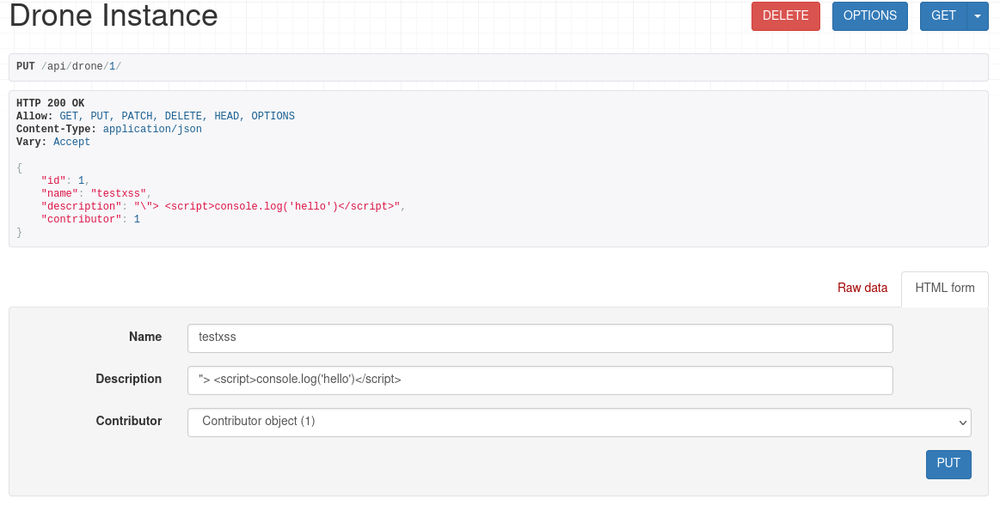

# Security overview

## Vulnerability resources 

Security resources to watch:

- [Django CVE](https://www.cvedetails.com/vendor/10199/?q=Djangoproject)
- [DRF CVE](https://www.cvedetails.com/product/88337/Encode-Django-Rest-Framework.html?vendor_id=23690)

To do:

- How to monitor python libraries vulnerabilities ?
- Found resources for Angular.io 

## Development

### Cross Site Scripting (XSS)

Django framework helps us to prevent JavaScript injection. 

The following example is a persistent XSS try. Django automatically checks user input and add a backslash to prevent string escape. 

The frontend also manage it by replacing javascript escape character (>) by the encoded version (\&lt;).

