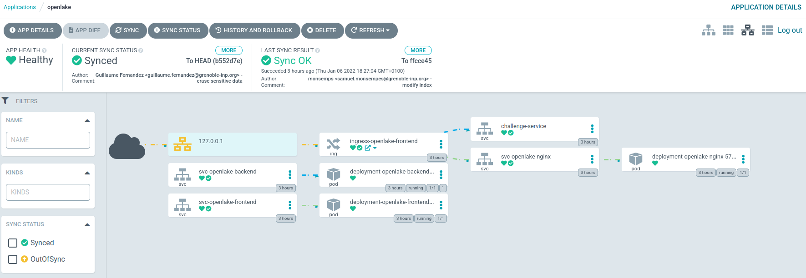

# [Beta] GitOps infrastructure

This directory provides Kubernetes yaml files. 
The open-lake.fr website monitors changes in the 'kubernetes' directory and automatically update his architecture.

**Theses files and the open-lake.fr web site are not ready for production. Some credentials can be found out inside yaml files; it's a Proof Of Concept, a secret management service will be added later.**

Argo CD is a declarative, GitOps continuous delivery tool for Kubernetes. It's the tool used to deployed and manage open-lake.fr.

For more information about the infrastructure, please refer to [the wiki](https://gitlab.ensimag.fr/monsemps/open-lake-health/-/wikis/home).